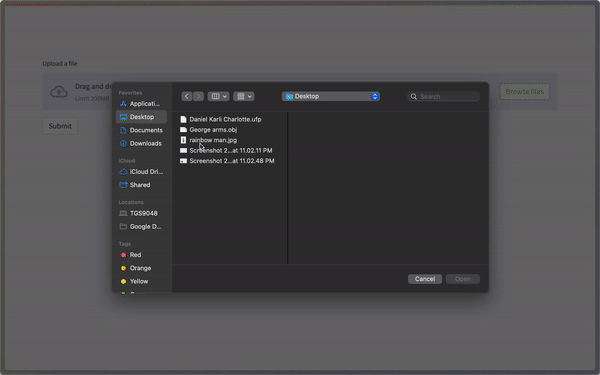

# 🪷 Lotus
Lotus is a Python Streamlit app to upload onto Estuary and generate QR codes for CIDs.

This is a hobby project, developed for fun and to play around with the [Estuary](https://estuary.tech) API in an education setting. 

If you want to deploy it yourself, I recommend using [Streamlit Cloud](https://streamlit.app) or a different provider such as [Fly.io](https://fly.io) or [Railway.app](https://railway.app). You will also need to request an account and create an API key on [Estuary](https://estuary.tech), although you could quite easily modify the code to use a different provider such as [Infura](https://infura.io).
